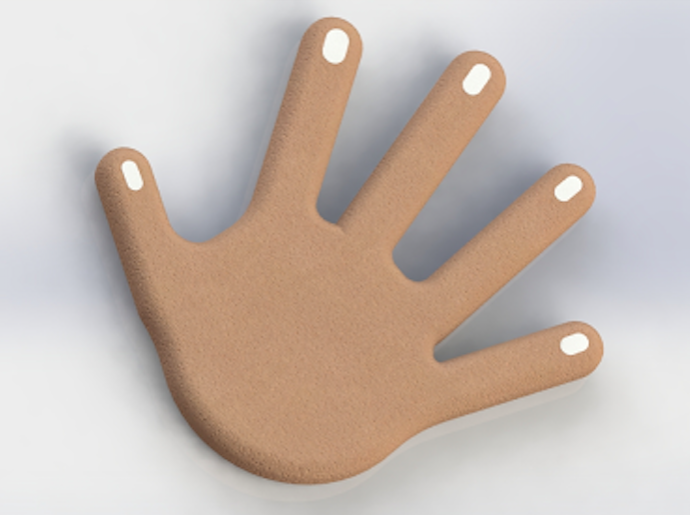

<html>
<body>

<h1> Weinstein_Daniel</h1>

Welcome to my website! Here you'll find all sorts of cool stuff for BME193. 
Let's start with an image

Now that's out of the way, here's my hand

<h2> CAD Hand </h2>

 • I tried 123D and Solidworks

 • I ended up using Solidworks, because it was easier to create sketches than 123D

 • Creating the sketch was the hardest part for me. I used splines, which required patience to draw a precise shape.

 • I would need to become comfortable with 3D Sketches to create detailing on the hand, such as elevated palms, knuckles, and veins. 

</body>
</html>
